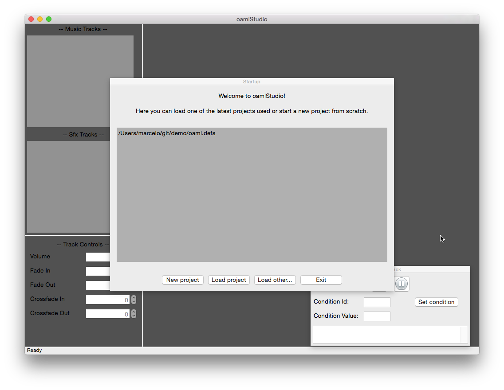
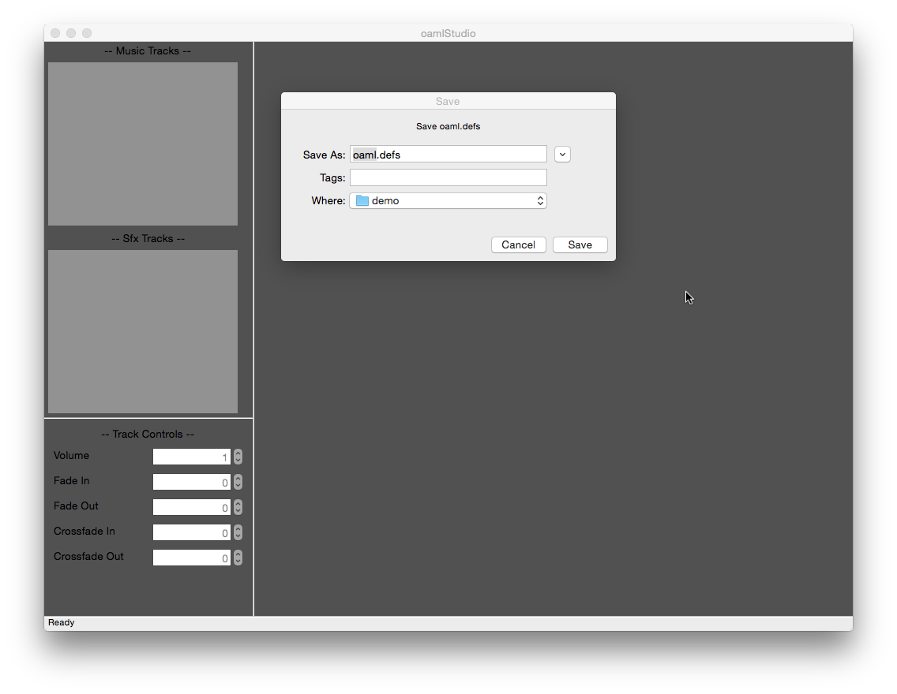
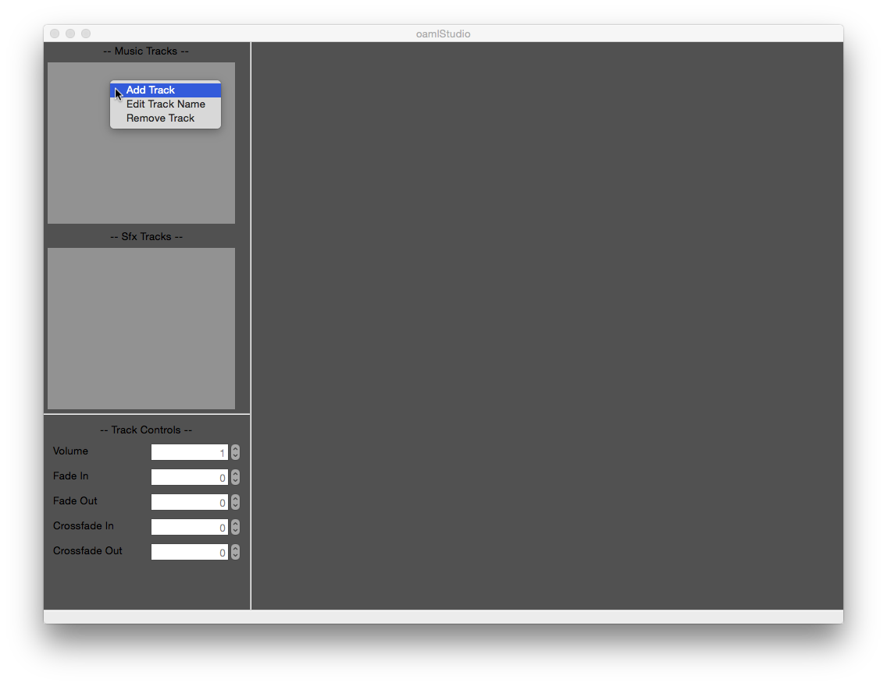
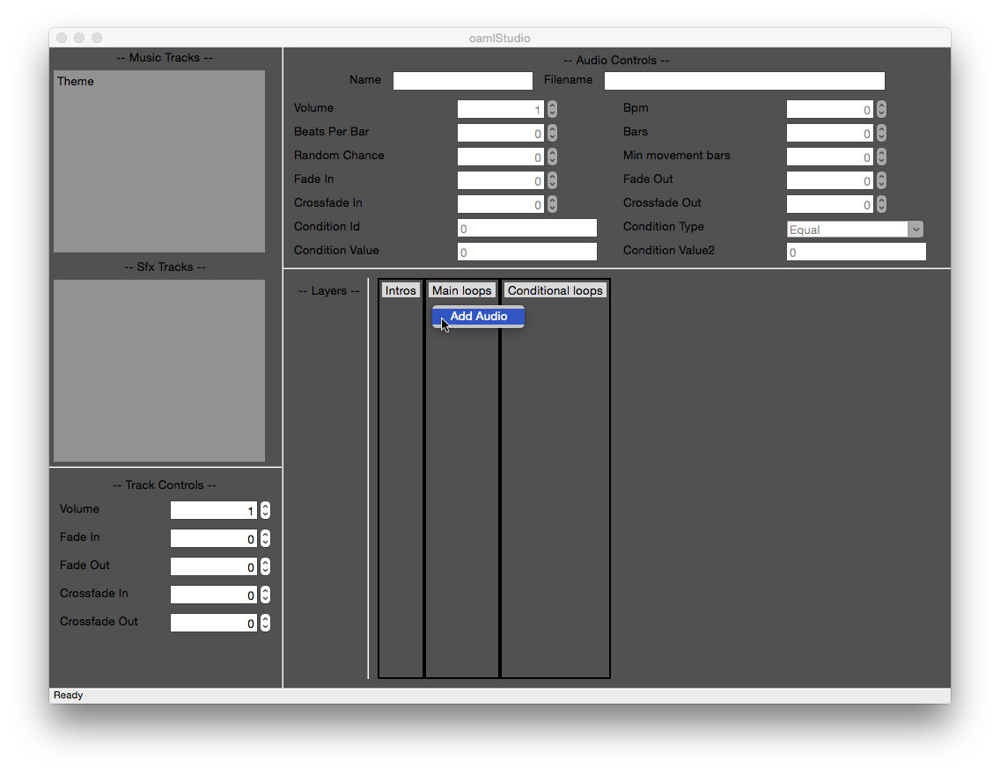
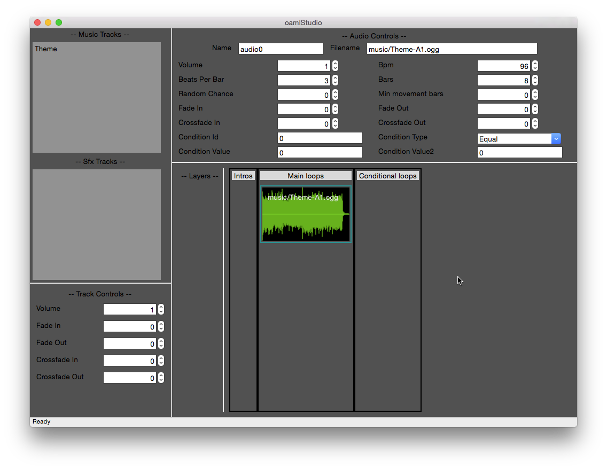

### Creating a simple project loop

* First you'll have to compose a music loop, or ask the music composer in your team to compose one, for this tutorial though we'll use loops that I've create for this tutorial series.

* Let's create our first project, it will contain one track with a basic music loop. Download the first loop file here: [music/Theme-A1.ogg](music/Theme-A1.ogg)

* Now let's start oamlStudio, open the application:

* And create a new project:

* Now let's add a track, right click on the Music Tracks panel and select "Add Track":

* Next step is to add the audio loop into the main loop area, right-click on the grey area, select "Add Audio" and pick the Theme-A1.ogg file:

* Now that we have a music loop we need to set the 'Bpm', 'Beats Per Bar' and 'Bars' settings, so that it will loop correctly, for this Theme-A1.ogg example the settings are: Bpm=96, Beats Per Bar=3, Bars=8.

* After you've set this settings you can hit play and the music will loop correctly.

### Adding an intro to the project loop

### Creating a condition
